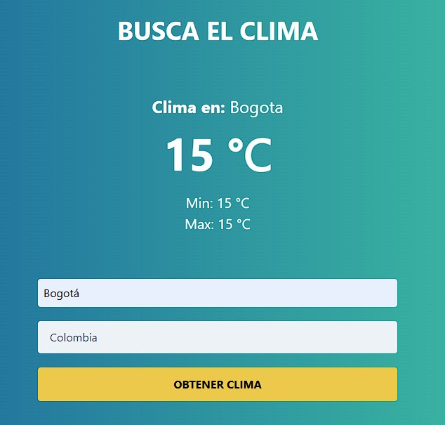

# Buscador Clima:

Consulta el clima de una ciudad de los siguientes paises:

- Argentina.
- Colombia.
- Costa Rica.
- España.
- Estados Unidos.
- México.
- Perú.

Hecho en ainilla JavaScript, con las siguientes caracteristicas:

- Validación de todos los campos requeridos.
- Utiliza "fetch" para consultas a la API.
- Usa Tailwind para los estilos.
___

## API

Para usar la API, es necesario crear cuenta en:

[OpenWeather](https://openweathermap.org/)

Allí crear una API Key, copiarla y pegarla en el archivo "js\app.js", como valor de la constante, en la siguiente línea:

```
const appId = "PEGAR_AQUÍ"; // Aquí debes colocar tu API Key
```
___

## Screenshots


